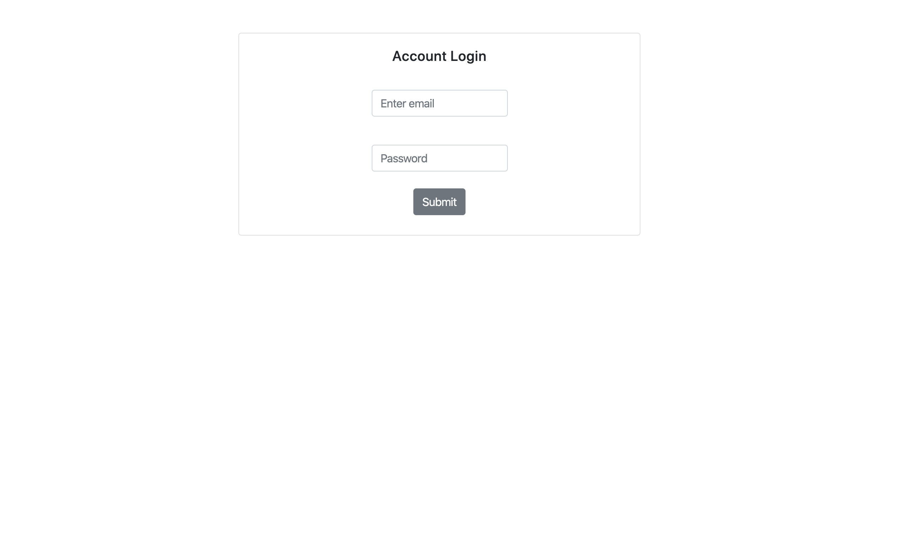

## Project Title：
登入系統，使用者資料正確可以登入
## Installing：
1. 打開你的 terminal，Clone 此專案至本機電腦
> git clone https://github.com/good800322/account-login
2. 開啟終端機(Terminal)，進入存放此專案的資料夾
> cd account-login
3. 安裝 npm 套件
> 在 Terminal 輸入 npm install 指令
4. 啟動伺服器，執行 app.js 檔案
> 在 Terminal 輸入 npm run dev 指令 
## Features：
1. 使用者可輸入郵件與密碼。
2. 若郵件密碼正確，進入歡迎頁面。
3. 若無輸入任何資料，維持原介面。
4. 輸入錯誤顯示提示訊息。
```js
 //使用者資料
 const users = [
        {
          firstName: 'Tony',
          email: 'tony@stark.com',
          password: 'iamironman'
        },
        {
          firstName: 'Steve',
          email: 'captain@hotmail.com',
          password: 'icandothisallday'
        },
        {
          firstName: 'Peter',
          email: 'peter@parker.com',
          password: 'enajyram'
        },
        {
          firstName: 'Natasha',
          email: 'natasha@gamil.com',
          password: '*parol#@$!'
        },
        {
          firstName: 'Nick',
          email: 'nick@shield.com',
          password: 'password'
        }
        ]
```